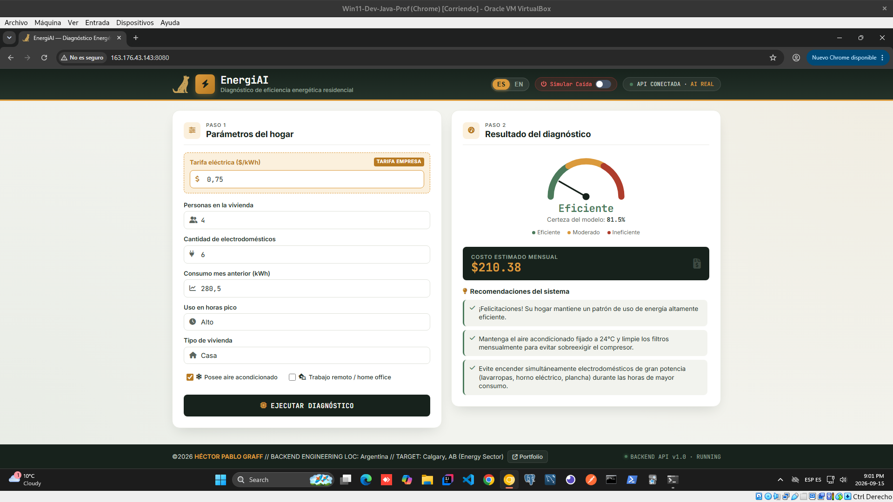
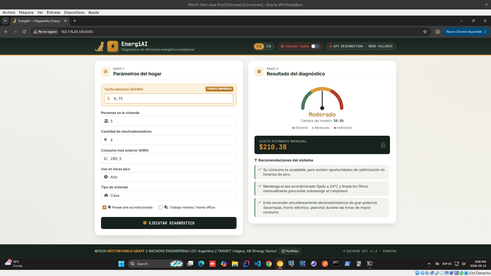
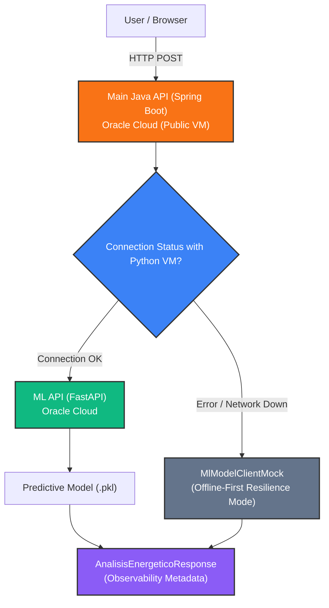

<div align="center">

# ⚡ EnergIAi

### Smart Residential Energy Consumption Analysis

🇪🇸 [Español](README_es.md)

*We turn electricity consumption data into useful information for making more sustainable decisions.*

[](#-technologies)
[](#-technologies)
[](#-technologies)
[](#-technologies)
[](#️-oci-infrastructure-architecture)
[](https://alura-es-cursos.github.io/proyectos-hackathon-g9-latam/)
[](#-project-status)

</div>

---

## 📖 Table of Contents

- [Description](#description)
- [Project Status](#project-status)
- [Problem and Need](#problem-and-need)
- [Key Features](#key-features)
- [User Interface and Observability](#interface)
- [System Architecture](#system-architecture)
- [Infrastructure Architecture (OCI)](#oci-architecture)
- [Load and Performance Testing (Benchmarking)](#benchmarking)
- [Project Components](#components)
- [Technologies](#technologies)
- [Dataset](#dataset)
- [Team and Role Attribution](#team)
- [How to Run the Project](#execution)
- [Technical Documentation](#technical-documentation)
- [Credits](#credits)
- [Author](#author)
- [License](#license)

---

<a id="description"></a>
## 📋 Description

**EnergIAi** is a residential energy analysis platform that combines **Artificial Intelligence, business rules, and a resilient backend architecture** to turn electricity consumption data into actionable information.

Based on parameters such as monthly consumption, number of appliances, habits during peak hours, and electricity rate, the solution allows you to:

- Classify a home's energy profile as **Efficient, Moderate, or Inefficient**.
- Generate recommendations aimed at reducing energy waste.
- Estimate the monthly financial impact using a **configurable rate ($/kWh)**.
- Integrate a Machine Learning model through an independent microservice.
- Maintain functional availability through a **Fallback** strategy in the event of AI service failures.
- Expose observability information directly in the user interface.

The project was originally developed for the **ONE Hackathon — G9 Projects | Alura + Oracle**, within the **Sustainability, Energy, and Smart Homes** track.

---

<a id="project-status"></a>
## 🚦 Project Status

| Component | Status |
|---|---|
| **OCI Infrastructure** (VCN, Subnet, Security Lists, 2 Compute VMs) | ✅ Deployed and operational |
| **Machine Learning API** (Python 3.12 / FastAPI) | ✅ Deployed on OCI as a `systemd` service |
| **Classification Model** (`.pkl`) | ✅ Trained, evaluated, and served in production |
| **Main Backend** (Java 21 LTS / Spring Boot 3.3.x) | ✅ 100% Functional — Layered architecture, Bean Validation, and Fallback |
| **Frontend & User Interface** (HTML5 / CSS3 / Vanilla JS) | ✅ 100% Functional — Dynamic gauge, configurable rate, and visual status indicator |

---

<a id="problem-and-need"></a>
## 🧩 Problem and Need

Residential electricity consumption can lead to high costs without the user having a clear view of which habits or home characteristics are related to that consumption.

**EnergIAi** aims to turn input data into a simple, interactive diagnosis through:

1. Visualization of the estimated monthly cost based on the configured rate.
2. Classification of the energy profile.
3. Identification of possible inefficiencies.
4. Automated recommendations aimed at savings and responsible consumption.

---

<a id="key-features"></a>
## ✨ Key Features

* **Configurable Rate ($/kWh):** Adaptive financial calculation based on the unit price entered by the user or company.
* **Native Internationalization (i18n):** Bilingual interface (**Spanish / English**) switchable in real time without reloading the page.
* **Fault Injection & Resilience (Kill Switch):** Includes a header toggle (*Simulate Outage*) that intercepts the request and forces the flow toward the `MlModelClientMock` client to test fault tolerance live.
* **Reactive Visual Observability:** The frontend detects the origin of the data (`IA_PYTHON_REAL` vs `MOCK_FALLBACK`) and automatically switches the header indicator:
  * 🟢 `API CONNECTED · REAL AI` (Real response served by the Python model).
  * 🔴 `API DISCONNECTED · FALLBACK MODE` (Contingency response due to simulation or network failure).

---

<a id="interface"></a>
## 📸 User Interface and Observability

### 1. Energy Profile Classification and Bilingual Support (ES / EN)

| 🟢 Efficient Profile | 🟡 Moderate Profile | 🔴 Inefficient Profile |
|:---:|:---:|:---:|
|  |  |  |
| *Optimized consumption with low financial impact.* | *Consumption within the average with room for improvement.* | *High consumption with alerts and savings recommendations.* |

> 🌐 **Internationalization:** The entire interface and diagnostics are switchable in real time between **Spanish (ES)** and **English (EN)** with a single click.

---

### 2. Real-Time Observability and Resilience (Kill Switch & Fallback)

| 🟢 Normal Operation (`IA_PYTHON_REAL`) | 🔴 Active Outage Simulation (`MOCK_FALLBACK`) |
|:---:|:---:|
|  |  |
| *Inference served in real time by the Python microservice.* | *Contingency response forced from the Simulation Toggle.* |

---

### 🎬 Live Demo

<div align="center">
  <a href="https://www.youtube.com/watch?v=ID_DE_TU_VIDEO" target="_blank">
    
  </a>
  <p><em>▶️ Click the image to watch the interactive demo on YouTube (Kill Switch test and ES/EN switching).</em></p>
</div>

---

<a id="system-architecture"></a>
## 🏗️ System Architecture



---

<a id="oci-architecture"></a>
## ☁️ Infrastructure Architecture (OCI)

The project is hosted on **Oracle Cloud Infrastructure (Free Tier)** in the Brazil East (São Paulo) region:

| Machine | Role | Public IP | Private IP | Port | Status |
|---|---|---|---|---|---|
| **Java VM** | Main Backend (Spring Boot 3.3.x) | `163.176.43.143` | `10.0.0.213` | 8080 | ✅ Operational |
| **Python VM** | ML Inference (FastAPI + `.pkl`) | `147.15.16.156` | `10.0.0.164` | 8000 | ✅ Operational (systemd) |

*Security Note:* Communication with the Python VM is restricted via **OCI Security Lists** and `iptables`, allowing traffic on port 8000 only from the internal subnet (`10.0.0.0/24`).

---

<a id="benchmarking"></a>
## ⚡ Load and Performance Testing (Benchmarking)

To ensure a genuine production standard, the API deployed on **Oracle Cloud Infrastructure (OCI)** was subjected to load and concurrency testing using **Grafana k6**, while monitoring hardware health in real time (`htop`) on the Ubuntu Virtual Machine.

The goal was to observe endpoint behavior under load and verify latency, error, and resource utilization metrics.

---

### 🏥 1. Infrastructure Diagnostics (`GET /health`)
* **Concurrency Tested:** Bursts of up to **30 simultaneous virtual users (VUs)**.
* **CPU Elasticity:** The JVM woke up cores on demand, going from **0.7% to 27.2% CPU usage**, and returning to baseline immediately after finishing.
* **SLA Metric:** Latency **$p(95) = 57.37\text{ ms}$** and **0.00% failure rate** over 1,687 requests.

| 🟢 1. Initial State (Baseline) | 🟡 2. Load Peak (30 VUs) | 🟢 3. Final Report (`k6`) |
|:---:|:---:|:---:|
|  |  |  |
| *Server at rest (0.7% CPU, ~420 MB RAM).* | *Elastic CPU scaling without degrading memory.* | *100% success rate, 0% errors, and $p(95) < 58\text{ ms}$.* |

---

### 🧪 2. Energy Ingestion and Calculation Service (`POST /analisis-energetico`)
* **Business Load:** Processing and interpretation of JSON DTOs with energy profile evaluation.
* **Memory Stability:** RAM held steady at **418 MB / 954 MB**, demonstrating the absence of memory leaks.
* **SLA Metric:** Latency **$p(95) = 74.36\text{ ms}$** and **0.00% failure rate** over 133 real requests.

| 🟢 1. Initial State (Baseline) | 🟡 2. Load Peak (5 VUs) | 🟢 3. Final Report (`k6`) |
|:---:|:---:|:---:|
|  |  |  |
| *Server ready to receive ingestion payloads.* | *Absorbing JSON load while keeping consumption at ~418 MB.* | *133 POST requests processed in $< 75\text{ ms}$.* |

---

<a id="components"></a>
## 📦 Project Components

| Folder | Responsibility | Documentation |
|---|---|---|
| [`backend-java/`](./backend-java) | Main API, orchestrator, business rules, and fallback | [README](./backend-java/README.md) |
| [`backend-python/`](./backend-python) | Machine Learning service (FastAPI inference) | [README](./backend-python/README.md) |
| [`data-science/`](./data-science) | Exploratory analysis, training, and serialization | [README](./data-science/README.md) |
| [`oci/`](./oci) | Infrastructure, scripts, and firewall rules | [README](./oci/README.md) |
| `postman/` | Postman collection for integration testing | — |

---

<a id="technologies"></a>
## 🛠️ Technologies

### Backend

- **Java 21 LTS**
- **Spring Boot 3.3.x**
- **Jakarta Bean Validation**
- Layered architecture
- REST APIs
- Fallback pattern

### Machine Learning

- **Python 3.12**
- **FastAPI**
- **Scikit-Learn**
- **Uvicorn**
- Model serialized via `.pkl`

### Frontend

- **HTML5**
- **CSS3**
- **Vanilla JavaScript**
- CSS Custom Properties
- CSS Keyframes

### Cloud & Infrastructure

- **Oracle Cloud Infrastructure (OCI)**
- OCI Compute
- VCN
- Security Lists
- **Linux / Ubuntu**
- `iptables`
- `systemd`

### Testing & Engineering

- **Grafana k6**
- **Postman**
- **OpenAPI / Swagger**
- **Git**
- **Conventional Commits**

---

<a id="dataset"></a>
## 📊 Dataset

The predictive model was trained using the public **[Household Energy Consumption](https://www.kaggle.com/datasets/samxsam/household-energy-consumption)** dataset from Kaggle, processed and optimized for supervised classification.

---

<a id="team"></a>
## 👥 Team and Role Attribution

### Jonathan Marino

Exploration, curation, and cleaning of the dataset through exploratory data analysis (EDA).

[LinkedIn](https://www.linkedin.com/in/jonathan-marino/)

### Hernán Pérez Melgar

Training and evaluation of the classification model and generation of the serialized model (`.pkl`).

[LinkedIn](https://www.linkedin.com/in/hernan-perez-melgar-320088184/)

### Héctor Pablo Graff — P4154N0

**Software Engineering & End-to-End Development**

Main responsibilities:

- Design and development of the **Core Backend** with Java 21 / Spring Boot 3.3.x.
- Implementation of DTOs, validations, and business rules.
- Design and implementation of the **Fallback strategy**.
- Development of the ML inference microservice with **Python / FastAPI**.
- Design of the integration architecture between Java, Python, and the predictive model.
- Design, deployment, and hardening of infrastructure on **Oracle Cloud Infrastructure (OCI)**.
- Design and execution of load and stress testing with **Grafana k6**.
- Analysis of latency, error, and resource utilization metrics.
- Infrastructure monitoring via `htop`.
- Frontend design and development.
- Implementation of the dynamic gauge.
- Implementation of the configurable rate.
- Implementation of ES / EN internationalization.
- Implementation of observability and API status visual indicators.

[LinkedIn](https://www.linkedin.com/in/hector-pablo-graff/)

### Collaborative Support

- Agustina Lerda
- Annie Lehmann
- Frank Mijhael Bendezu Hinostroza

---

<a id="execution"></a>
## ⚙️ How to Run the Project

### 1. Clone the repository

```bash
git clone https://github.com/P4154N0/energiai.git
cd energiai
```
---

### 2. Start the AI Microservice (Python)

```bash
cd backend-python
pip install -r requirements.txt
uvicorn app.main:app --host 0.0.0.0 --port 8000 --reload
```
---

### 3. Start the Main Backend (Java)

```bash
cd backend-java
./mvnw spring-boot:run
```
---

The application will be accessible from the browser at http://localhost:8080.

---

<a id="technical-documentation"></a>
## 📄 Technical Documentation

http://localhost:8080/swagger-ui.html

---

<a id="credits"></a>
## 🙌 Credits & Acknowledgments

Project developed as part of the **No Country** work simulation program together with the **ONE (Oracle Next Education)** program — G9 Projects | **Alura Latam** + **Oracle**.

---

## 👤 Author

Designed and developed by **P4154N0 (Héctor Pablo Graff)**.

**Software engineer specialized in distributed systems and telemetry architectures.** Currently based in Argentina, with the professional goal of bringing technological value to the **energy and industrial sectors** in Calgary, Alberta, Canada.

🔗 [**LinkedIn**](https://www.linkedin.com/in/hector-pablo-graff/)  
💻 [**Portfolio**](https://p4154n0.github.io/portfolio/)

---

## 📄 License

The source code of this project is licensed under the **MIT** license.

See the [**LICENSE**](./LICENSE) file for the full terms.

Personal content, presentation materials, and third-party resources are not covered by the MIT license unless expressly stated otherwise.