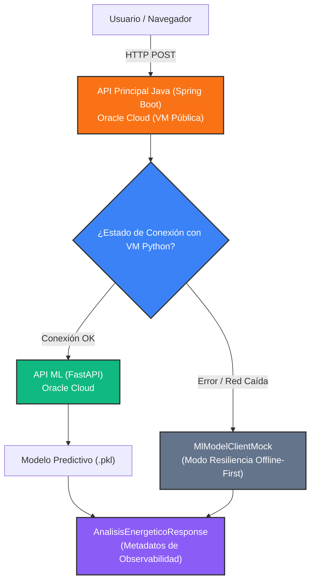

<div align="center">

# ⚡ EnergIAi

### Análisis Inteligente de Consumo Energético Residencial

*Transformamos datos de consumo eléctrico en información útil para tomar decisiones más sostenibles.*

[](#-tecnologías)
[](#-tecnologías)
[](#-tecnologías)
[](#-tecnologías)
[](#️-arquitectura-de-infraestructura-oci)
[](https://alura-es-cursos.github.io/proyectos-hackathon-g9-latam/)
[](#-estado-del-proyecto)

</div>

---

## 📖 Índice

- [Descripción](#descripción)
- [Estado del proyecto](#estado-del-proyecto)
- [Problema y Necesidad](#problema-y-necesidad)
- [Características Clave](#características-clave)
- [Interfaz de Usuario y Observabilidad](#interfaz)
- [Arquitectura del Sistema](#arquitectura-sistema)
- [Arquitectura de Infraestructura (OCI)](#arquitectura-oci)
- [Pruebas de Carga y Rendimiento (Benchmarking)](#benchmarking)
- [Componentes del Proyecto](#componentes)
- [Tecnologías](#tecnologías)
- [Dataset](#dataset)
- [Atribución de Roles y Equipo](#equipo)
- [Cómo ejecutar el proyecto](#ejecucion)
- [Documentación Técnica](#documentacion-tecnica)
- [Créditos](#créditos)
- [Autor](#autor)
- [Licencia](#licencia)

---

<a id="descripción"></a>
## 📋 Descripción

**EnergIAi** es una plataforma de análisis energético residencial que combina **Inteligencia Artificial, reglas de negocio y una arquitectura backend resiliente** para transformar datos de consumo eléctrico en información accionable.

A partir de parámetros como el consumo mensual, cantidad de electrodomésticos, hábitos durante horarios pico y tarifa eléctrica, la solución permite:

- Clasificar el perfil energético de una vivienda como **Eficiente, Moderado o Ineficiente**.
- Generar recomendaciones orientadas a reducir el desperdicio energético.
- Estimar el impacto económico mensual mediante una **tarifa configurable ($/kWh)**.
- Integrar un modelo de Machine Learning mediante un microservicio independiente.
- Mantener la disponibilidad funcional mediante una estrategia de **Fallback** ante fallos del servicio de IA.
- Exponer información de observabilidad directamente en la interfaz de usuario.

El proyecto fue desarrollado originalmente para el **Hackathon ONE — Proyectos G9 | Alura + Oracle**, dentro del track **Sostenibilidad, Energía y Casas Inteligentes**.

---

<a id="estado-del-proyecto"></a>
## 🚦 Estado del Proyecto

| Componente | Estado |
|---|---|
| **Infraestructura OCI** (VCN, Subred, Security Lists, 2 VMs Compute) | ✅ Desplegada y operativa |
| **API de Machine Learning** (Python 3.12 / FastAPI) | ✅ Desplegada en OCI como servicio `systemd` |
| **Modelo de Clasificación** (`.pkl`) | ✅ Entrenado, evaluado y servido en producción |
| **Backend Principal** (Java 21 LTS / Spring Boot 3.3.x) | ✅ 100% Funcional — Arquitectura por capas, Bean Validation y Fallback |
| **Frontend & Interfaz de Usuario** (HTML5 / CSS3 / Vanilla JS) | ✅ 100% Funcional — Velocímetro dinámico, Tarifa configurable e indicador visual de estado |

---

<a id="problema-y-necesidad"></a>
## 🧩 Problema y Necesidad

El consumo eléctrico residencial puede generar costos elevados sin que el usuario tenga una visión clara de qué hábitos o características de su vivienda están relacionados con ese consumo.

**EnergIAi** busca convertir datos de entrada en un diagnóstico sencillo e interactivo mediante:

1. Visualización del costo mensual estimado según la tarifa configurada.
2. Clasificación del perfil energético.
3. Identificación de posibles ineficiencias.
4. Recomendaciones automatizadas orientadas al ahorro y al consumo responsable.

---

<a id="características-clave"></a>
## ✨ Características Clave

* **Tarifa Configurable ($/kWh):** Cálculo financiero adaptativo según el valor por unidad ingresado por el usuario o empresa.
* **Internacionalización Nativa (i18n):** Interfaz bilingüe (**Español / Inglés**) conmutable en tiempo real sin recargar la página.
* **Inyección de Fallas & Resiliencia (Kill Switch):** Incluye un interruptor en cabecera (*Simular Caída*) que intercepta la solicitud y fuerza el flujo hacia el cliente `MlModelClientMock` para probar la tolerancia a fallos en vivo.
* **Observabilidad Visual Reactiva:** El frontend detecta el origen de los datos (`IA_PYTHON_REAL` vs `MOCK_FALLBACK`) y conmuta automáticamente el indicador de la cabecera:
  * 🟢 `API CONECTADA · IA REAL` (Respuesta real servida por el modelo en Python).
  * 🔴 `API DESCONECTADA · MODO FALLBACK` (Respuesta de contingencia por simulación o caída de red).

---

<a id="interfaz"></a>
## 📸 Interfaz de Usuario y Observabilidad

### 1. Clasificación del Perfil Energético y Soporte Bilingüe (ES / EN)

| 🟢 Perfil Eficiente | 🟡 Perfil Moderado | 🔴 Perfil Ineficiente |
|:---:|:---:|:---:|
|  |  |  |
| *Consumo optimizado con bajo impacto financiero.* | *Consumo dentro del promedio con margen de mejora.* | *Consumo elevado con alertas y recomendaciones de ahorro.* |

> 🌐 **Internacionalización:** Toda la interfaz y el diagnósticos son conmutables en tiempo real entre **Español (ES)** e **Inglés (EN)** en un solo clic.

---

### 2. Observabilidad y Resiliencia en Tiempo Real (Kill Switch & Fallback)

| 🟢 Operación Normal (`IA_PYTHON_REAL`) | 🔴 Simulación de Caída Activa (`MOCK_FALLBACK`) |
|:---:|:---:|
|  |  |
| *Inferencia servida en tiempo real por el microservicio en Python.* | *Respuesta de contingencia forzada desde el Toggle de Simulación.* |

---

### 🎬 Demostración en Vivo (Live Demo)

<div align="center">
  <a href="https://www.youtube.com/watch?v=ID_DE_TU_VIDEO" target="_blank">
    
  </a>
  <p><em>▶️ Haz clic en la imagen para ver la demostración interactiva en YouTube (Prueba de Kill Switch y conmutación ES/EN).</em></p>
</div>

---

<a id="arquitectura-sistema"></a>
## 🏗️ Arquitectura del Sistema



---

<a id="arquitectura-oci"></a>
## ☁️ Arquitectura de Infraestructura (OCI)

El proyecto se encuentra alojado en **Oracle Cloud Infrastructure (Free Tier)** en la región Brazil East (São Paulo):

| Máquina | Rol | IP pública | IP privada | Puerto | Estado |
|---|---|---|---|---|---|
| **VM Java** | Backend Principal (Spring Boot 3.3.x) | `163.176.43.143` | `10.0.0.213` | 8080 | ✅ Operativa |
| **VM Python** | Inferencia ML (FastAPI + `.pkl`) | `147.15.16.156` | `10.0.0.164` | 8000 | ✅ Operativa (systemd) |

*Nota de Seguridad:* La comunicación hacia la VM de Python está restringida mediante **Security Lists de OCI** e `iptables`, permitiendo tráfico al puerto 8000 únicamente desde la subred interna (`10.0.0.0/24`).

---

<a id="benchmarking"></a>
## ⚡ Pruebas de Carga, Rendimiento (Benchmarking)

Para garantizar un estándar de producción real, la API desplegada en **Oracle Cloud Infrastructure (OCI)** fue sometida a pruebas de carga y concurrencia utilizando **Grafana k6**, monitoreando en tiempo real la salud del hardware (`htop`) en la Virtual Machine Ubuntu.

El objetivo fue observar el comportamiento de los endpoints bajo carga y verificar métricas de latencia, errores y utilización de recursos.

---

### 🏥 1. Diagnóstico de Infraestructura (`GET /health`)
* **Concurrencia Probada:** Ráfagas de hasta **30 usuarios virtuales (VUs)** simultáneos.
* **Elasticidad de Procesador:** La JVM despertó los núcleos bajo demanda pasando de **0.7% a 27.2% de CPU**, retornando al estado basal inmediatamente al finalizar.
* **Métrica SLA:** Latencia **$p(95) = 57.37\text{ ms}$** y **0.00% tasa de fallos** sobre 1,687 peticiones.

| 🟢 1. Estado Inicial (Basal) | 🟡 2. Pico de Carga (30 VUs) | 🟢 3. Reporte Final (`k6`) |
|:---:|:---:|:---:|
|  |  |  |
| *Servidor en reposo (0.7% CPU, ~420 MB RAM).* | *Escalado elástico de CPU sin degradar la memoria.* | *1,00% de éxito, 0% errores y $p(95) < 58\text{ ms}$.* |

---

### 🧪 2. Servicio de Ingesta y Cálculo Energético (`POST /analisis-energetico`)
* **Carga de Negocio:** Procesamiento e interpretación de DTOs JSON con evaluación del perfil energético.
* **Estabilidad de Memoria:** Memoria RAM congelada en **418 MB / 954 MB** demostrando la ausencia de fugas de memoria (*memory leaks*).
* **Métrica SLA:** Latencia **$p(95) = 74.36\text{ ms}$** y **0.00% tasa de fallos** sobre 133 peticiones reales.

| 🟢 1. Estado Inicial (Basal) | 🟡 2. Pico de Carga (5 VUs) | 🟢 3. Reporte Final (`k6`) |
|:---:|:---:|:---:|
|  |  |  |
| *Servidor listo para recibir payloads de ingesta.* | *Absorción de carga JSON manteniendo consumo en ~418 MB.* | *133 peticiones POST procesadas en $< 75\text{ ms}$.* |

---

<a id="componentes"></a>
## 📦 Componentes del Proyecto

| Carpeta | Responsabilidad | Documentación |
|---|---|---|
| [`backend-java/`](./backend-java) | API principal, orquestador, reglas de negocio y fallback | [README](./backend-java/README.md) |
| [`backend-python/`](./backend-python) | Servicio de Machine Learning (Inferencia FastAPI) | [README](./backend-python/README.md) |
| [`data-science/`](./data-science) | Análisis exploratorio, entrenamiento y serialización | [README](./data-science/README.md) |
| [`oci/`](./oci) | Infraestructura, scripts y reglas de firewall | [README](./oci/README.md) |
| `postman/` | Colección de Postman para pruebas de integración | — |

---

<a id="tecnologías"></a>
## 🛠️ Tecnologías

### Backend

- **Java 21 LTS**
- **Spring Boot 3.3.x**
- **Jakarta Bean Validation**
- Arquitectura por capas
- REST APIs
- Patrón Fallback

### Machine Learning

- **Python 3.12**
- **FastAPI**
- **Scikit-Learn**
- **Uvicorn**
- Modelo serializado mediante `.pkl`

### Frontend

- **HTML5**
- **CSS3**
- **JavaScript Vanilla**
- CSS Custom Properties
- CSS Keyframes

### Cloud & Infraestructura

- **Oracle Cloud Infrastructure (OCI)**
- OCI Compute
- VCN
- Security Lists
- **Linux / Ubuntu**
- `iptables`
- `systemd`

### Testing & Engineering

- **Grafana k6**
- **Postman**
- **OpenAPI / Swagger**
- **Git**
- **Conventional Commits**

---

<a id="dataset"></a>
## 📊 Dataset

El modelo predictivo fue entrenado utilizando el dataset público **[Household Energy Consumption](https://www.kaggle.com/datasets/samxsam/household-energy-consumption)** de Kaggle, procesado y optimizado para clasificación supervisada.

---

<a id="equipo"></a>
## 👥 Equipo y Atribución de Roles

### Jonathan Marino

Exploración, curado y limpieza del dataset mediante análisis exploratorio de datos (EDA).

[LinkedIn](https://www.linkedin.com/in/jonathan-marino/)

### Hernán Pérez Melgar

Entrenamiento y evaluación del modelo de clasificación y generación del modelo serializado (`.pkl`).

[LinkedIn](https://www.linkedin.com/in/hernan-perez-melgar-320088184/)

### Héctor Pablo Graff — P4154N0

**Ingeniería de Software & Desarrollo Integral End-to-End**

Responsabilidades principales:

- Diseño y desarrollo del **Backend Core** con Java 21 / Spring Boot 3.3.x.
- Implementación de DTOs, validaciones y reglas de negocio.
- Diseño e implementación de la **estrategia Fallback**.
- Desarrollo del microservicio de inferencia ML con **Python / FastAPI**.
- Diseño de la arquitectura de integración entre Java, Python y el modelo predictivo.
- Diseño, despliegue y hardening de infraestructura en **Oracle Cloud Infrastructure (OCI)**.
- Diseño y ejecución de pruebas de carga y estrés con **Grafana k6**.
- Análisis de métricas de latencia, errores y utilización de recursos.
- Monitoreo de infraestructura mediante `htop`.
- Diseño y desarrollo del frontend.
- Implementación del velocímetro dinámico.
- Implementación de tarifa configurable.
- Implementación de internacionalización ES / EN.
- Implementación de indicadores visuales de observabilidad y estado de API.

[LinkedIn](https://www.linkedin.com/in/hector-pablo-graff/)

### Soporte Colaborativo

- Agustina Lerda
- Annie Lehmann
- Frank Mijhael Bendezu Hinostroza

---

<a id="ejecucion"></a>
## ⚙️ Cómo Ejecutar el Proyecto

### 1. Clonar el repositorio

```bash
git clone https://github.com/P4154N0/energiai.git
cd energiai
```
---

### 2. Iniciar el Microservicio de IA (Python)

```bash
cd backend-python
pip install -r requirements.txt
uvicorn app.main:app --host 0.0.0.0 --port 8000 --reload
```
---

### 3. Iniciar el Backend Principal (Java)

```bash
cd backend-java
./mvnw spring-boot:run
```
---

La aplicación estará accesible desde el navegador en http://localhost:8080.

---

<a id="documentacion-tecnica"></a>
## 📄 Documentación Técnica

http://localhost:8080/swagger-ui.html

---

<a id="créditos"></a>
## 🙌 Créditos & Agradecimientos

Proyecto desarrollado en el marco de la simulación laboral de **No Country** junto al programa **ONE (Oracle Next Education)** — Proyectos G9 | **Alura Latam** + **Oracle**.

---

## 👤 Autor

Diseñado y desarrollado por **P4154N0 (Héctor Pablo Graff)**.

**Ingeniero de software especializado en sistemas distribuidos y arquitecturas de telemetría.** Actualmente radicado en Argentina, con el objetivo profesional de aportar valor tecnológico a los **sectores energético e industrial** en Calgary, Alberta, Canadá.

🔗 [**LinkedIn**](https://www.linkedin.com/in/hector-pablo-graff/)  
💻 [**Portfolio**](https://p4154n0.github.io/portfolio/)

---

## 📄 Licencia

El código fuente de este proyecto se encuentra bajo la licencia **MIT**.

Consulta el archivo [**LICENSE**](./LICENSE) para conocer los términos completos.

El contenido personal, materiales de presentación y recursos de terceros no están cubiertos por la licencia MIT salvo que se indique expresamente lo contrario.
